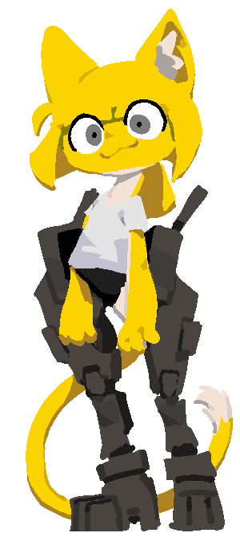

<html lang="en">
<head>
    <meta charset="UTF-8">
    <meta name="viewport" content="width=device-width, initial-scale=1.0">
    <title>Glitchy Neocities Template</title>
    
</head>
<body>
    <h1 id="glitchText" class="glitch">PLASTIC RHAPSODY</h1>
    

    

        
Misc Text Page

        
Webcomic Page

        
Misc Text Page

    

    

        <h1>Plastic Rhapsody</h1>
        <h2>Welcome to my webpage</h2>
        
CITY GIRL ILLEGAL JOB METAL LEG

    

    

        <button onclick="prevPage()">Previous</button>
        
        <button onclick="nextPage()">Next</button>
    

    

        <h2>blablablabla</h2>
        
blablablablablablabalbablablabala

    

    

        
    

    
</body>
</html>
